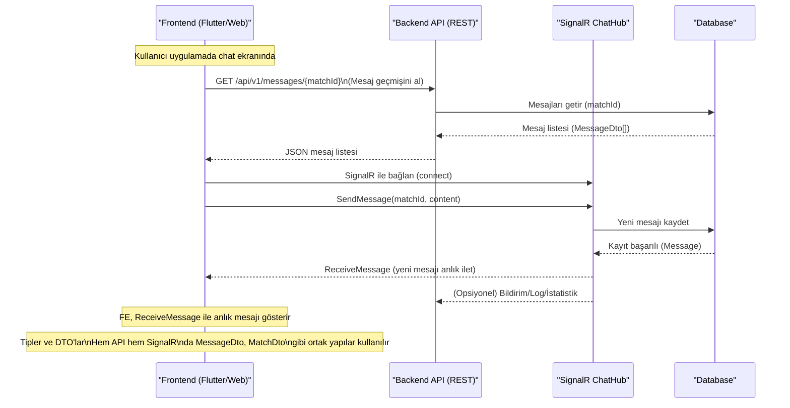

# PawMatch Chat Sistemi: API ve SignalR Akışı

Aşağıda, PawMatch projesinde chat/messaging sisteminin hem REST API hem de SignalR ile nasıl birlikte çalıştığı şematik olarak gösterilmiştir.

---

---

## Açıklama
- Kullanıcı chat ekranında ilk açılışta API'dan mesaj geçmişini çeker.
- SignalR ile bağlanır, yeni mesaj gönderir.
- SignalR üzerinden gelen mesajlar anlık olarak ekranda gösterilir.
- Hem API hem SignalR tarafında aynı DTO'lar (ör. MessageDto) kullanılır, tip tutarlılığı sağlanır.

---

**Not:**
- Bu yapı, modern chat uygulamalarında yaygın olarak kullanılır.
- API geçmiş ve offline mesajlar için, SignalR ise anlık iletişim için kullanılır.
- Tip karışıklığı olmaması için backend'de tüm id alanları int/int? olarak tanımlanmıştır.
